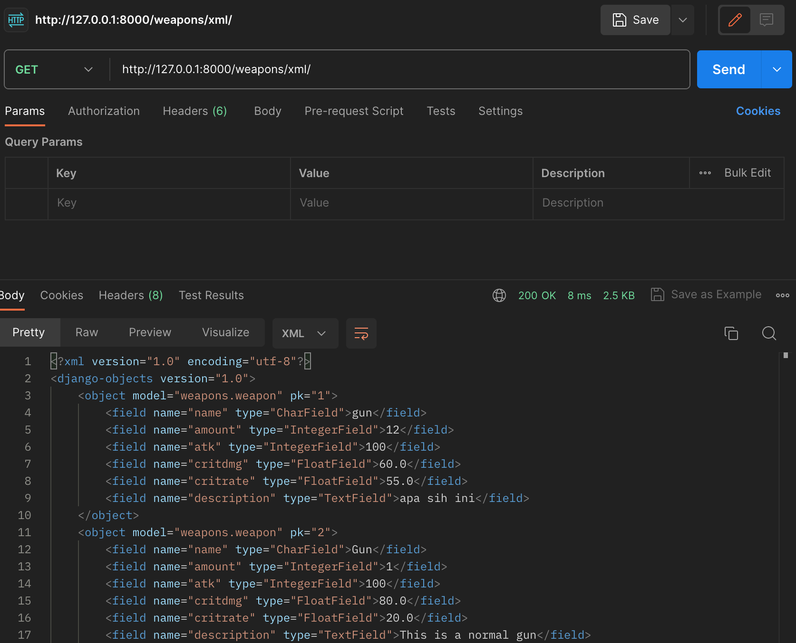
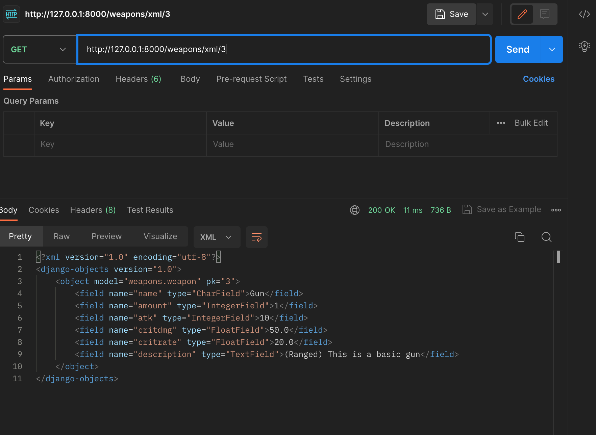
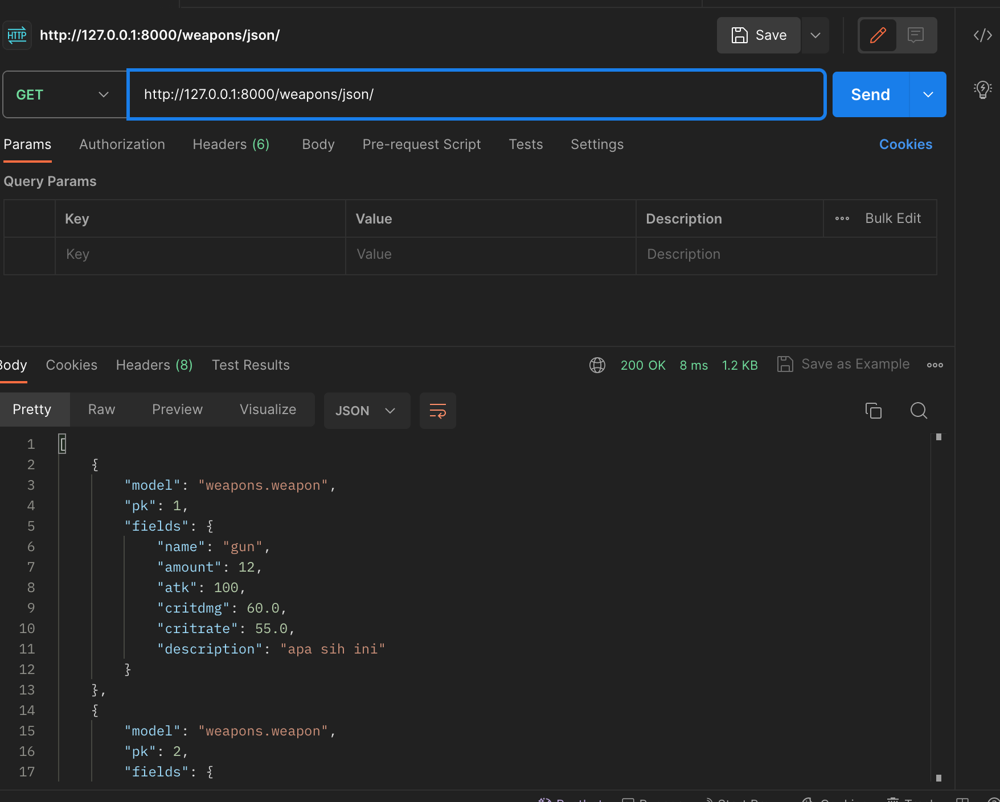
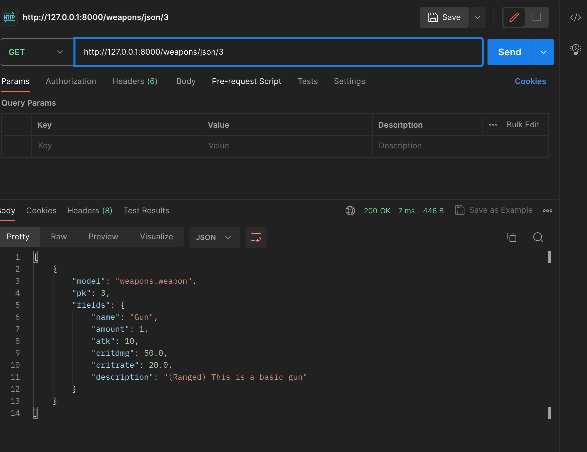
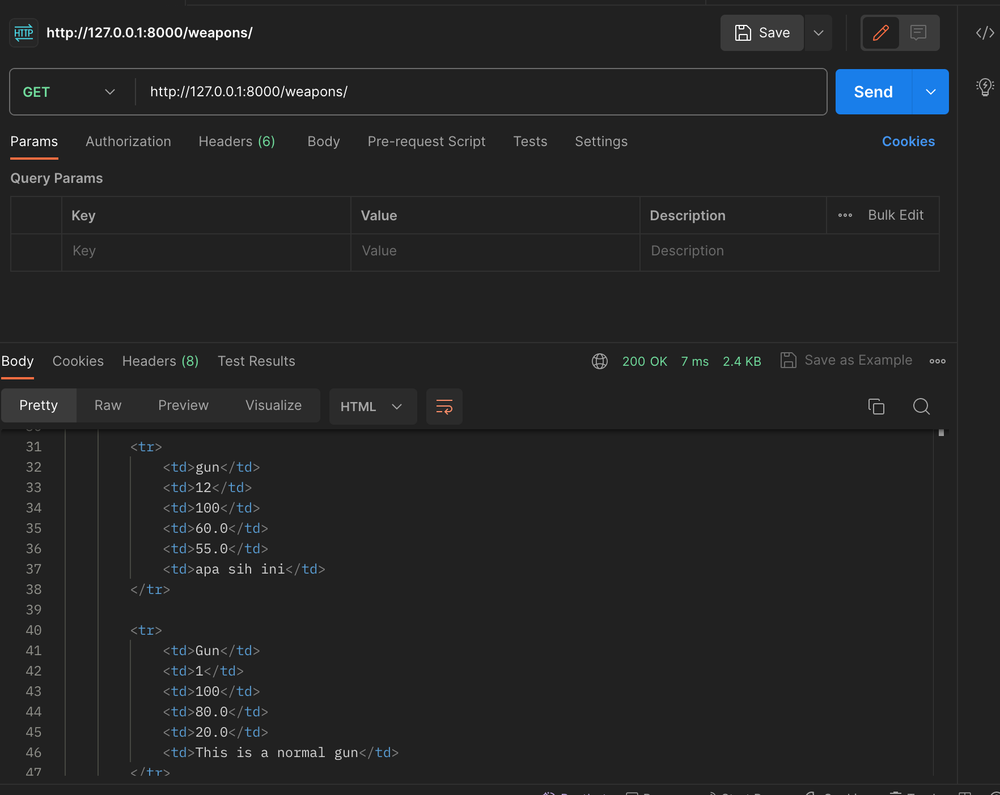

Naufal Ichsan - 2206082013 - F  
**PBP Tugas 2**    
**Step by Step**
1. **Membuat sebuah proyek Django baru.**  
      1. Membuat direktori baru bernama weapon_inventory.  
      2. Menginisiasi virtual environment yang saya beri nama env dan mengaktifkannya dengan command 'source env/bin/ activate'      
      3. Melakukan download seluruh dependencies termasuk django itu sendiri melalui requirements.txt menggunakan pip didalam virtual environment     
      4. Menggunakan command 'django-admin startproject weapon_inventory .' untuk menginisasi project django baru bernama weapon_inventory      
2. **Membuat aplikasi dengan nama main pada proyek tersebut.**     
      1. Menggunakan command 'python3 manage.py startapp weapons --> saya memberi nama app saya weapons bukan main,    
      menurut saya nama ini lebih cocok untuk membuat sebuah weapon inventory      
      2. Saya mendaftarkan app weapons kedalam settings --> INSTALLED APPS yang ada pada projek weapon_inventory     
3. **Melakukan routing pada proyek agar dapat menjalankan aplikasi main.**     
      1. Saya membuat file urls.py pada app weapon terlebih dahulu       
      2. Saya mengimpor include pada urls.py pada proyek untuk memasukkan urls pada aplikasi weapons pada list urlpattern Syntax saya gunakan adalah 'path('', include('weapons.urls'))' --> pada syntax terdapat 'path('', url) disini saya   beri string kosong agar app langsung keredirect ke weapons.views ketika link diklik   
4. **Membuat model pada aplikasi main dengan nama Item dan memiliki atribut wajib sebagai berikut.**   
   - **name sebagai nama item dengan tipe CharField.**   
   - **amount sebagai jumlah item dengan tipe IntegerField.**   
   - **description sebagai deskripsi item dengan tipe TextField.**   
      1. Saya melakukan import models dari djangodb   
      2. Saya membuat class Weapon yang isinya adalah atribut seperti diatas   
      3. Saya menambahkan beberapa attributes seperti atk, critrate, dan critdmg yang menurut saya relevan dengan weapons attributes      
5. **Membuat sebuah fungsi pada views.py untuk dikembalikan ke dalam sebuah template HTML yang menampilkan nama aplikasi serta nama dan kelas kamu.**    
      1. Saya membuat folder templates terlebih dahulu yang isinya merupakan template html yang saya beri nama weapons.html untuk menampilkan apa yang ada di views    
      2. Saya melakukan import render dari django.shortcut pada views.py dan membuat function show_weapons yang berfungsi menampilkan weapons weapons yang ada    
      3. Di dalam Function saya membuat suatu dict yang berisi key berdasarkan models yang sudah dibuat dan valuenya.   
      4. Setelahnya, saya melakukan return kepada weapons.html agar data yang ada di views dapat ditampilkan oleh html   
6. **Membuat sebuah routing pada urls.py aplikasi main untuk memetakan fungsi yang telah dibuat pada views.py.**   
      1. saya membuat berkas urls.py pada direktori weapons yang nantinya akan disi urlpatterns juga, nantinya urlpatterns ini akan diarahkan ke fungsi show_weapons yang ada pada weapons.views   
7.  **Melakukan deployment ke Adaptable terhadap aplikasi yang sudah dibuat sehingga nantinya dapat diakses oleh teman-temanmu melalui Internet.**   
      1. Melakukan deploy ke adaptable seperti pada tutorial 0 yang membedakan adalah pada start command diberikan perintah 'python manage.py migrate && gunicorn weapon_inventory.wsgi' agar mengarah ke wsgi weapon_inventory   

**Buatlah bagan yang berisi request client ke web aplikasi berbasis Django beserta responnya dan jelaskan pada bagan tersebut kaitan antara urls.py, views.py, models.py, dan berkas html.**        

   Request----------------urls.py------------------------views.py-------------models.py-------------Templates   
   ---↓-----------------------↓------------------------------↓---------------------↓----------------------↓     
   Client  ────────>   URL Dispatcher  ──────>   Views  ──────>   Models  ──────>   HTML   
          <────────  HTTP Response   <───────   <──────────   <──────────   <──────────   

Request dari Client: Permintaan HTTP pertama kali diterima dari klien oleh Django.   

**URL Dispatcher (urls.py)**: Berkas urls.py mencocokkan URL yang diterima dari klien dengan pola URL yang ada dan mengarahkannya ke view yang sesuai.

**Views (views.py)**: Views adalah tempat logika aplikasi terletak. views.py menerima permintaan dari URL Dispatcher, memprosesnya, dan menyiapkan data yang akan ditampilkan oleh template.

**Models (models.py)**: Models mengelola struktur dan logika data. models.py berinteraksi dengan database sql dan memungkinkan views untuk mengambil atau menyimpan data.

**Templates (HTML)**: Templates adalah file HTML yang digunakan untuk merender tampilan akhir yang akan ditampilkan kepada klien. Mereka mengambil data dari views.py melalui template engine Django.

**HTTP Response ke Client**: Hasil akhir dalam bentuk HTTP Response dikirim kembali ke klien untuk ditampilkan sebagai output.


**Jelaskan mengapa kita menggunakan virtual environment? Apakah kita tetap dapat membuat aplikasi web berbasis Django tanpa menggunakan virtual environment?**

Virtual environment biasa kita gunakan dalam pengembangan perangkat lunak, termasuk dalam pengembangan aplikasi web berbasis Django, dengan tujuan utama diantaranya:

1. **Isolasi Lingkungan:** Virtual environment memungkinkan kita untuk membuat lingkungan pengembangan yang terisolasi. Setiap virtual environment memiliki lingkungan yang terpisah dari interpreter Python dan library yang dibutuhkan. Ini memungkinkan kita mengelola dependensi proyek yang ingin dilakukan secara terpisah dan menghindari konflik antara versi library yang berbeda yang mungkin dibutuhkan oleh berbagai proyek Kita.

2. **Manajemen Dependensi:** Dengan virtual environment, kita dapat mengelola dependensi proyek dengan lebih baik. Kita dapat menggunakan pip untuk menginstall, mengupgrade, atau menghapus library tertentu hanya dalam lingkungan virtual proyek kita, tanpa mempengaruhi Python atau proyek lain yang berjalan di lingkungan yang berbeda.

3. **Versi Python yang Berbeda:** Jika kita memiliki banyak proyek yang memerlukan versi Python yang berbeda, kita dapat dengan mudah membuat virtual environment yang sesuai dengan versi Python yang diperlukan untuk setiap proyek.

4. **Keamanan Proyek:** Isolasi dengan virtual environment dapat membantu mengurangi risiko memengaruhi proyek lain ketika kita menginstall atau mengupgrade library yang diinginkan oleh salah satu proyek. Hal ini membantu menjaga stabilitas dan keamanan proyek-proyek tersebut.

5. **Mudah Dipindahkan:** Virtual environment adalah lingkungan yang dapat dibuat, disalin, dan dipindahkan dengan mudah. Ini memudahkan kita untuk berbagi proyek dengan developer lain atau menjalankannya di lingkungan/directory yang berbeda.

Django sendiri dapat dijalankan tanpa adanya virtual environment. Namun, ini bukan best practice dan dapat menyebabkan beberapa masalah, terutama ketika kita bekerja pada beberapa proyek atau jika kita mau mengelola dependensi dengan baik. Menggunakan virtual environment akan membantu kita menghindari potensi masalah konflik dependensi dan memungkinkan kita untuk mengisolasi setiap proyek dengan lebih baik.


**Jelaskan apakah itu MVC, MVT, MVVM dan perbedaan dari ketiganya.**
MVC, MVT, dan MVVM adalah tiga pola arsitektur perangkat lunak yang umum digunakan dalam pengembangan perangkat lunak, terutama dalam pengembangan aplikasi web. Masing-masing memiliki tujuan dan konsep yang berbeda. Di bawah ini saya akan menjelaskan masing-masing pola tersebut beserta perbedaannya yang saya dapatkan dari berbagai sumber:

1. **MVC (Model-View-Controller):**
   - **Model** merupakan komponen yang bertanggung jawab untuk mengelola logika dan data aplikasi. Model mengurus akses ke database atau penyimpanan data, serta menjalankan operasi operasi tertentu.
   - **View** merupakan komponen yang bertanggung jawab untuk menampilkan data kepada pengguna. Tampilan mengambil informasi dari Model dan menampilkan tampilan yang sesuai untuk pengguna.
   - **Controller** merupakan komponen yang bertindak sebagai perantara antara Model dan View. Ini menerima input dari pengguna, memprosesnya, dan mengubah Model atau tampilan sesuai dengan input tersebut.

   **Perbedaan Utama:** MVC memisahkan aplikasi menjadi tiga komponen utama (Model, View, Controller) untuk mengelola tanggung jawab dan logika aplikasi. Ini adalah pola yang paling umum digunakan dalam pengembangan aplikasi web.

2. **MVT (Model-View-Template):**
   - **Model** seperti dalam MVC, Model bertanggung jawab atas logika dan akses ke data.
   - **View** dalam MVT mirip dengan View dalam MVC, bertanggung jawab untuk tampilan yang diberikan kepada pengguna.   
   - **Template** merupakan komponen yang memproses tampilan dan mengisi data dari Model ke dalam tampilan sebelum mengirimkannya ke pengguna.

   **Perbedaan Utama:** MVT adalah varian dari MVC yang digunakan dalam kerangka kerja Django, yang biasanya digunakan untuk pengembangan web. Perbedaan utamanya adalah adanya Template yang bertanggung jawab untuk memproses tampilan, sementara dalam MVC, tampilan biasanya diolah oleh View.

3. **MVVM (Model-View-ViewModel):**
   - **Model** seperti dalam MVC dan MVT, Model mengurus data dan logika.
   - **View** merupakan tampilan yang diberikan kepada pengguna, seperti dalam pola MVC dan MVT.
   - **ViewModel** merupakan komponen yang menghubungkan Model dan View. Ini berisi logika tampilan dan berfungsi sebagai perantara antara Model dan View. ViewModel sering digunakan dalam pengembangan aplikasi berbasis antarmuka pengguna (UI), seperti aplikasi mobile.

   **Perbedaan Utama:** MVVM adalah pola arsitektur yang lebih khusus digunakan dalam pengembangan antarmuka pengguna. ViewModel bertindak sebagai perantara antara Model dan View, memisahkan tampilan dan logika dengan baik. Ini sering digunakan dalam pengembangan aplikasi berbasis antarmuka pengguna yang kompleks.

Saat memilih pola arsitektur untuk proyek, penting untuk mempertimbangkan kebutuhan proyek dan jenis aplikasi yang kita kembangkan. MVC dan MVT adalah pilihan umum untuk pengembangan web, sedangkan MVVM lebih umum digunakan dalam pengembangan aplikasi berbasis antarmuka pengguna. Setiap pola memiliki kelebihan dan kelemahan sendiri, dan pilihan terbaik tergantung pada konteks proyek yang dikerjakan.


----------------
**PBP Tugas 3**    
**Apa perbedaan antara form POST dan form GET dalam Django?**  
Pada Django, baik metode POST maupun GET adalah metode HTTP yang digunakan untuk mengirim data dari browser ke server. Namun, keduanya memiliki perbedaan utama dalam cara mereka mengirim dan mengelola data:

1. **Metode POST**:

   - **Keamanan**: Metode POST lebih aman dibandingkan dengan GET karena data yang dikirim melalui metode POST tidak terlihat di URL. Data dikirim sebagai "request body" dan tidak terlihat oleh pengguna atau di history browser.
   
   - **Penggunaan**: Metode POST digunakan ketika kita ingin mengirim data yang sensitif atau data yang akan mengubah keadaan server, seperti mengirim data formulir yang akan menyimpan atau memperbarui data di database.

   - **Pemrosesan**: Data yang dikirim dengan metode POST dapat diakses di Django menggunakan `request.POST` dalam view kita. Data ini biasanya digunakan untuk memproses formulir, menyimpan data, atau melakukan tindakan lain yang mengubah server.

   - **Pembatasan Panjang Data**: Metode POST tidak memiliki batasan panjang data yang diterima, sehingga kita dapat mengirim data yang lebih besar daripada metode GET.


2. **Metode GET**:

   - **Visibilitas**: Data yang dikirim dengan metode GET ditambahkan ke URL, yang berarti data ini terlihat di bilah alamat browser. Ini tidak aman untuk data sensitif karena dapat dengan mudah dilihat oleh pengguna atau terekam dalam history browser.

   - **Penggunaan**: Metode GET digunakan ketika kita ingin mengambil data dari server tanpa mengubah keadaan server. Ini adalah metode yang umum digunakan untuk mengambil halaman web, pencarian, atau berbagi tautan.

   - **Pemrosesan**: Data yang dikirim dengan metode GET dapat diakses di Django menggunakan `request.GET` dalam view kita. Data ini biasanya digunakan untuk mengambil parameter atau query string dari URL.

   - **Pembatasan Panjang Data**: Metode GET memiliki batasan panjang data yang dapat dikirim melalui URL. Ini tergantung pada pengaturan server web dan browser, dan data yang terlalu panjang dapat terpotong.

**Apa perbedaan utama antara XML, JSON, dan HTML dalam konteks pengiriman data?**   
XML, JSON, dan HTML adalah tiga format yang umum digunakan untuk mengirim dan menyimpan data dalam konteks pengembangan perangkat lunak web dan aplikasi. Berikut adalah perbedaan utama antara ketiganya:

1. **XML (Extensible Markup Language)**:

   - **Struktur**: XML adalah bahasa markup yang digunakan untuk mengatur dan mengstruktur data. Ia memiliki sintaks yang ketat dengan tag pembuka dan penutup, yang dapat membungkus data dan atribut.

   - **Tujuan Utama**: XML sering digunakan untuk pertukaran data antara aplikasi yang berbeda atau untuk menyimpan data dalam format yang dapat diolah secara struktural.

   - **Fleksibilitas**: XML sangat fleksibel dan memungkinkan kita mendefinisikan struktur data kita sendiri menggunakan Dokumen DTD (Document Type Definition) atau XML Schema.

   - **Ekstensibilitas**: XML dapat digunakan untuk mendefinisikan bahasa markup yang khusus untuk aplikasi tertentu.

   - **Contoh**: 
     ```xml
     <person>
         <name>John Doe</name>
         <age>30</age>
     </person>
     ```

2. **JSON (JavaScript Object Notation)**:

   - **Struktur**: JSON adalah format yang terdiri dari pasangan nama-nilai (key-value pairs). Ia lebih ringkas dibandingkan dengan XML karena tidak memiliki tag pembuka dan penutup.

   - **Tujuan Utama**: JSON digunakan untuk pertukaran data antara klien dan server web dalam aplikasi web dan API RESTful. JSON juga digunakan secara luas dalam penyimpanan data dan konfigurasi.

   - **Fleksibilitas**: JSON memiliki struktur yang lebih sederhana dibandingkan XML dan biasanya lebih mudah dibaca oleh manusia.

   - **Ekstensibilitas**: JSON lebih terbatas dalam hal definisi struktur data dibandingkan dengan XML.

   - **Contoh**: 
     ```json
     {
         "name": "John Doe",
         "age": 30
     }
     ```

3. **HTML (Hypertext Markup Language)**:

   - **Struktur**: HTML adalah bahasa markup yang digunakan untuk membuat halaman web dan mengatur tampilan konten web. Ia memiliki elemen-elemen yang mendefinisikan struktur dan tampilan halaman web.

   - **Tujuan Utama**: HTML digunakan untuk membuat halaman web yang dapat diakses oleh browser. Ia tidak digunakan secara langsung untuk pertukaran data antara aplikasi, meskipun bisa digunakan untuk menampilkan data dalam bentuk yang dapat dilihat oleh pengguna.

   - **Fleksibilitas**: HTML memiliki struktur yang terbatas dan terkait erat dengan tampilan halaman web.

   - **Ekstensibilitas**: HTML memiliki elemen-elemen bawaan yang didefinisikan oleh spesifikasi HTML dan tidak dapat diperluas dengan mudah seperti XML.

   - **Contoh**: 
     ```html
     <html>
         <head>
             <title>Contoh Halaman HTML</title>
         </head>
         <body>
             <h1>Selamat datang!</h1>
             <p>Ini adalah contoh halaman HTML.</p>
         </body>
     </html>
     ```

Dalam konteks pengiriman data, XML dan JSON lebih sering digunakan untuk mengirim data antara aplikasi, sementara HTML digunakan untuk membuat halaman web yang dapat dilihat oleh pengguna melalui browser. Pemilihan format tergantung pada kebutuhan aplikasi dan tipe data yang akan ditangani.  

**Mengapa JSON sering digunakan dalam pertukaran data antara aplikasi web modern?**  
JSON (JavaScript Object Notation) sering digunakan dalam pertukaran data antara aplikasi web modern karena memiliki beberapa keunggulan yang membuatnya sangat cocok untuk tugas ini:

1. **Ringkas dan Mudah Dibaca**: JSON memiliki struktur yang sederhana dengan pasangan nama-nilai (key-value pairs) yang membuatnya mudah dibaca dan ditulis oleh manusia. Ini membuatnya sangat berguna untuk debugging dan pengembangan.

2. **Penggunaan dalam JavaScript**: JSON berasal dari JavaScript, sehingga sangat mudah diintegrasikan dengan kode JavaScript yang banyak digunakan dalam pengembangan web. Ini memungkinkan data JSON untuk digunakan langsung dalam JavaScript tanpa perlu parsing yang rumit.

3. **Kemampuan Parsing**: Sebagian besar bahasa pemrograman memiliki dukungan bawaan atau pustaka untuk parsing JSON. Ini membuatnya sangat mudah diimplementasikan dalam aplikasi yang ditulis dalam berbagai bahasa pemrograman.

4. **Ringan**: JSON adalah format yang ringan, artinya tidak ada tambahan berat data seperti tag pembuka dan penutup seperti pada XML. Ini mengurangi overhead dalam pertukaran data.

5. **Bacaan dan Penulisan Data**: JSON mendukung berbagai tipe data, termasuk string, angka, boolean, array, dan objek. Ini membuatnya sangat fleksibel dalam menggambarkan data dari berbagai jenis.

6. **Kompatibilitas Web**: JSON sangat kompatibel dengan web dan digunakan secara luas dalam pengembangan aplikasi web, terutama dalam API RESTful. Banyak layanan web, seperti API media sosial dan layanan cloud, menyediakan data dalam format JSON.

7. **Parsial dan Penanganan Kesalahan**: JSON memungkinkan untuk memetakan bagian tertentu dari objek atau array, yang berguna ketika kita hanya perlu mengambil sebagian dari data yang tersedia. Selain itu, JSON dapat dengan mudah menangani kesalahan tanpa menghentikan pengolahan keseluruhan dokumen.

8. **Desentralisasi**: JSON tidak memerlukan skema sentral yang ketat seperti XML. Ini memungkinkan aplikasi mengirim data tanpa harus mengikuti skema yang sudah ditentukan sebelumnya.

9. **Dukungan Cross-platform**: JSON dapat digunakan untuk pertukaran data antara berbagai platform, termasuk aplikasi web, aplikasi seluler, dan layanan server.

Dengan semua keunggulan ini, JSON telah menjadi format pertukaran data yang sangat populer dalam pengembangan aplikasi web modern, terutama dalam konteks RESTful API, di mana ia memungkinkan komunikasi yang efisien dan mudah diimplementasikan antara klien dan server.  

**Step by Step**  
1. **Membuat input form untuk menambahkan objek model pada app sebelumnya.**
   1.  Sebelum membuat form saya membuat templates di root folder dan mengisinya dengan skeleton `base.html` dan menambahkannya ke TEMPLATES pada `settings.py` untuk menerapkannya sebagai kerangka yang ada pada templates pada folder weapons.
   2. setelah itu saya membuat `forms.py` pada folder weapons, tujuannya adalah untuk menambahkan input data dari user.
   3. Saya membuat class WeaponForm yang memiliki model yang diambil dari class Weapon dan memiliki fields sesuai dengan atribut yang dimiliki class Weapon dari `models.py`.
   4. Setelahnya saya membuat `add_weapons.html` pada templates yang ada pada folder weapons menggunakan format yang ada pada `base.html`, tidak lupa untuk mengganti format untuk `weapons.html` juga.

2. **Menambahkan 5 fungsi views untuk melihat objek yang sudah ditambahkan dalam format HTML, XML, JSON, XML by ID, dan JSON by ID.**  
   1. Hal yang pertama saya lakukan adalah melakukan import HttpResponse dari django.http dan reverse dari django.urls pada `views.py`
   2. Lalu saya membuat fungsi add_weapons yang bertujuan untuk menampilkan data dalam format HTML
   3. Saya juga menambahkan fungsi show_xml, show_json, show_xml_by_id, show_json_by_id seperti pada tutorial untuk menampilkan data dalam bentuk xml dan json dan mencari data berdasarkan idnya nantinya fungsi ini akan melakukan return HttpResponse dengan serializer yang berfungsi untuk mengubah data menjadi format yang diinginkan.
   4. Tidak lupa pada fungsi show_weapons saya menambahkan variable `weapons = Weapon.objects.all()` yang bertujuan untuk melakukan return pada setiap objek dari class Weapon yang sudah dibuat. variable weapons ini juga dimasukkan kedalam context untuk dipanggil dalam html nantinya.
   
3. **Membuat routing URL untuk masing-masing views yang telah ditambahkan pada poin 2.**
 1. Menambahkan url pattern pada `urls.py` yang ada pada folder weapons. 
 berikut url untuk masing masing function yang telah dibuat pada `views.py`
 ```python
 ...
path('add_weapons', add_weapons, name='add_weapons'),
path('xml/', show_xml, name='show_xml'),
path('json/', show_json, name='show_json'),
path('xml/<int:id>/', show_xml_by_id, name='show_xml_by_id'),
path('json/<int:id>/', show_json_by_id, name='show_json_by_id'), 
...
 ```
   
**Screenshot Pengaksesan Data**   
- **XML**  

- **XML/Id**
  
- **JSON** 
 
- **JSON/Id**
  
- **HTML**
    


----------------
**PBP Tugas 4**   
**Apa itu Django UserCreationForm, dan jelaskan apa kelebihan dan kekurangannya?**
`UserCreationForm` adalah salah satu form bawaan (built-in form) yang disediakan oleh Django untuk mengelola proses pembuatan pengguna (user) dalam aplikasi web. Form ini khusus digunakan untuk membuat pengguna baru atau akun pengguna. Kelebihan dan kekurangan dari `UserCreationForm` yang dikutip dari beberapa sumber adalah sebagai berikut:

**Kelebihan:**

1. **Sederhana dan Cepat:** `UserCreationForm` memungkinkan kita dengan mudah membuat formulir pendaftaran pengguna dengan sedikit kode. kita tidak perlu membuat formulir dari awal.

2. **Validasi Bawaan:** Form ini menyertakan validasi bawaan untuk memastikan pengguna memasukkan informasi yang benar, seperti alamat email yang valid dan kata sandi yang cukup kuat.

3. **Integrasi dengan Django Authentication:** `UserCreationForm` terintegrasi dengan sistem otentikasi bawaan Django, yang memudahkan manajemen sesi pengguna, otentikasi, dan otorisasi.

4. **Customizable:** kita dapat menyesuaikan tampilan dan perilaku `UserCreationForm` sesuai dengan kebutuhan aplikasi kita.

**Kekurangan:**

1. **Terbatas dalam Desain Tampilan:** Form ini hanya menyediakan fungsi dasar untuk pendaftaran pengguna. Jika kita memerlukan desain tampilan yang sangat kustom atau kompleks, kita mungkin perlu menggantinya dengan formulir yang kita buat sendiri.

2. **Diperlukan Penyesuaian Tambahan:** Untuk mengintegrasikan `UserCreationForm` ke dalam proyek kita, kita mungkin perlu menambahkan penanganan kesalahan khusus, penanganan pengiriman email verifikasi, dan fitur-fitur tambahan sesuai dengan kebijakan keamanan aplikasi kita.

**Apa perbedaan antara autentikasi dan otorisasi dalam konteks Django, dan mengapa keduanya penting?**  

**Autentikasi (Authentication):**
Autentikasi adalah proses verifikasi identitas pengguna yang mencoba mengakses aplikasi kita. Tujuannya adalah untuk memastikan bahwa pengguna yang mengklaim identitas tertentu (seperti nama pengguna atau alamat email) adalah benar-benar pengguna yang terdaftar dan memiliki hak akses ke aplikasi tersebut. Dalam konteks Django, autentikasi dapat dilakukan dengan menggunakan mekanisme built-in seperti `User` model. Proses autentikasi akan memvalidasi kredensial pengguna (misalnya, kata sandi) untuk memastikan kebenaran identitas.

**Otorisasi (Authorization):**
Otorisasi adalah proses yang terjadi setelah autentikasi dan berkaitan dengan hak akses pengguna terhadap berbagai bagian dari aplikasi. Ini menentukan apa yang diizinkan oleh pengguna untuk dilakukan dalam aplikasi berdasarkan identitas mereka dan peran yang mereka miliki. Otorisasi memeriksa apakah pengguna memiliki izin untuk melakukan tindakan tertentu, seperti melihat halaman tertentu, membuat perubahan di basis data, atau menjalankan tugas tertentu. Dalam Django.

**Perbedaan Utama:**
- Autentikasi berkaitan dengan verifikasi identitas pengguna (siapa mereka), sedangkan otorisasi berkaitan dengan pengendalian hak akses pengguna (apa yang mereka boleh lakukan).

**Pentingnya Autentikasi dan Otorisasi:**
- Autentikasi penting untuk melindungi aplikasi dari pengguna yang tidak sah atau tidak berwenang. Ini memastikan bahwa hanya pengguna yang terdaftar yang memiliki akses ke aplikasi kita.

- Otorisasi penting untuk mengendalikan apa yang pengguna boleh dan tidak boleh lakukan dalam aplikasi. Ini melindungi data dan sumber daya dari penyalahgunaan dan memastikan bahwa pengguna hanya dapat melakukan tindakan yang sesuai dengan peran dan izin mereka.

- Kedua konsep ini bekerja bersama-sama untuk menyediakan lingkungan yang aman dan sesuai hukum bagi pengguna aplikasi web. Autentikasi memastikan bahwa pengguna adalah siapa yang mereka klaim, sedangkan otorisasi mengontrol apa yang dapat mereka lakukan setelah terotentikasi.  


**Apa itu cookies dalam konteks aplikasi web, dan bagaimana Django menggunakan cookies untuk mengelola data sesi pengguna?**  

Cookies adalah sejumlah kecil data yang disimpan di sisi klien (pada perangkat pengguna) oleh browser web saat pengguna berinteraksi dengan situs web. Dalam konteks aplikasi web, cookies digunakan untuk menyimpan informasi sementara seperti preferensi pengguna, riwayat sesi, atau data otentikasi. Cookies memungkinkan situs web untuk mengenali pengguna saat mereka kembali ke situs tersebut, yang memungkinkan penyimpanan informasi antara kunjungan berbeda.

Django menggunakan cookies untuk mengelola data sesi pengguna melalui mekanisme yang disebut "session cookies." Berikut cara Django menggunakan cookies untuk mengelola sesi pengguna:

1. **Mengidentifikasi Pengguna:** Ketika pengguna mengakses situs web Django, server dapat membuat sebuah cookie yang berisi identifier unik (biasanya berupa session ID) untuk mengenali pengguna. Cookie ini dikirim ke perangkat pengguna dan disimpan di dalam browser.

2. **Menyimpan Data Sesi:** Django dapat menggunakan session cookies untuk menyimpan data sesi pengguna seperti informasi login, keranjang belanja, preferensi, atau data lain yang harus dijaga antar permintaan HTTP.

3. **Memvalidasi dan Memperbarui Data Sesi:** Setiap kali pengguna melakukan permintaan ke situs web, session ID diambil dari cookie di dalam request. Server Django kemudian menggunakan session ID ini untuk mengidentifikasi sesi pengguna yang sesuai dan mengambil atau memperbarui data sesi yang terkait.

4. **Keamanan:** Django secara otomatis mengelola session cookies dengan aman. Ini termasuk mengenkripsi data di dalam cookies dan menghindari masalah umum seperti session fixation dan session hijacking.

5. **Ekspirasi Cookies:** Django dapat mengatur waktu ekspirasi untuk session cookies, yang berarti cookies ini akan kadaluarsa setelah jangka waktu tertentu atau saat pengguna keluar atau menutup browser.

Dengan menggunakan cookies dan mekanisme sesi yang dikelola oleh Django, pengembang web dapat membuat pengalaman pengguna yang lebih dinamis dan personal, serta menjaga informasi sensitif seperti data otentikasi dengan aman.

**Apakah penggunaan cookies aman secara default dalam pengembangan web, atau apakah ada risiko potensial yang harus diwaspadai?**  

Penggunaan cookies dalam pengembangan web tidak sepenuhnya aman secara default dan dapat memiliki risiko potensial yang harus diwaspadai. Beberapa risiko yang saya dapatkan dari browsing terkait dengan penggunaan cookies meliputi:

1. **Pencurian Data:** Cookies dapat menjadi target potensial bagi penyerang yang mencoba mencuri data sensitif, seperti informasi login atau data sesi pengguna. Jika cookies tidak dienkripsi dengan baik, mereka bisa diretas.

2. **Session Hijacking:** Penyerang dapat mencoba mencuri session ID atau cookies sesi pengguna untuk mendapatkan akses ke akun pengguna tanpa izin. Ini dapat mengakibatkan pencurian identitas atau akses ilegal.

3. **Session Fixation:** Penyerang dapat mencoba memanipulasi cookies sesi pengguna dengan memberikan session ID yang sudah mereka siapkan sebelumnya. Ini bisa memungkinkan mereka mendapatkan akses ke sesi pengguna yang sah.

4. **Privacy Concerns:** Pengguna sering kali memiliki kekhawatiran tentang privasi dan pelacakan online. Penggunaan cookies untuk melacak aktivitas online dapat dianggap sebagai pelanggaran privasi pengguna.

5. **Cross-Site Scripting (XSS):** Jika cookies dieksekusi oleh kode JavaScript yang tidak aman (misalnya, dalam kasus kerentanan XSS), cookies dapat digunakan untuk mengambil data pengguna.

6. **Cookie Theft:** Jika perangkat pengguna dicuri atau diakses oleh orang lain, cookies yang tersimpan di dalam browser dapat digunakan untuk akses ilegal ke akun pengguna.

Dalam rangka menjaga keamanan pengguna dan data mereka, penting untuk mengimplementasikan praktik keamanan yang baik dalam penggunaan cookies. Ini termasuk enkripsi data sensitif dalam cookies, mengatur waktu ekspirasi yang tepat, dan menghindari menyimpan data sensitif dalam cookies jika memungkinkan.   

**Step by Step**  
1. **Mengimplementasikan fungsi registrasi, login, dan logout untuk memungkinkan pengguna untuk mengakses aplikasi sebelumnya dengan lancar.**  
   1. Saya membuat fungsi register pada `views.py` di folder weapons yang menerapkan `UserCreationForm()` dengan method `POST`, apabila berhasil login maka form akan disimpan dan melakukan redirect ke menu login
   2. Tidak lupa saya membuat HTML untuk register sebagai tampilan web, untuk template HTMLnya untuk saat ini saya ambil dari tutorial
   3. Saya membuat fungsi login_user yang menggunakan `authenticate(request, username=username, password=password)` yang berfungsi untuk melakukan autentikasi/pengecekan terhadap username dan password yang dibuat saat register. Apabila sesuai maka akan melakukan direct ke `weapons.html` melalui fungsi show_weapons. Apabila tidak sesuai maka akan mengeluarkan message "Sorry, incorrect username or password. Please try again."
   4. Untuk saat ini saya menggunakan template dari tutorial untuk `login.html `
   5. Saya membuat fungsi logout_user yang menggunakan `logout` dari `django.contrib.auth` yang akan melakukan logout suatu user dan setelahnya saya direct ke menu login. Setelah itu saya integrasikan fungsi logout ini dengan button logout pada weapons.html.
   6. Tidak lupa untuk menambahkan tiga fungsi yang baru dibuat pada `urls.py` pada folder weapons.
   7. Untuk merestriksi halaman utama saya menambahkan `@login_required(login_url='/login')` diatas fungsi show_weapons
   
2. **Membuat dua akun pengguna dengan masing-masing tiga dummy data menggunakan model yang telah dibuat pada aplikasi sebelumnya untuk setiap akun di lokal.**  
   1. Saya membuat dua akun dengan username `naufal.ichsan` dan `kucinghutan` dan masing masing akun melakukan add weapons sebanyak 3 kali.

3. **Menghubungkan model Item dengan User.**
   1. Saya melakukan import `User` pada `models.py` lalu menambahkan `user = models.ForeignKey(User, on_delete=models.CASCADE)` pada class Weapon untuk mengasosiasikan satu produk dengan satu user.
   2. lalu pada fungsi add_weapons pada `views.py` saya menambahkan `weapons = form.save(commit=False)`, commit false disini bertujuan agar data tidak langsung dipush ke databases. Setelah itu saya menambahkan `product.user = request.user` untuk menandakan bahwa weapons yang di add sesuai dengan user yang bersangkutan.
   

4. **Menampilkan detail informasi pengguna yang sedang logged in seperti username dan menerapkan cookies seperti last login pada halaman utama aplikasi.**
   1. Untuk menampilkan username user, pada fungsi show_weapons saya mengganti value pada name dalam context menjadi `request.user.username` untuk mendapatkan username dari user bersangkutan.
   2. Pada fungsi show_weapons didalam context saya menambahkan `'last_login': request.COOKIES['last_login']` untuk mendapatkan informasi terakhir login user.
   3. Pada fungsi login_user dibawah `if user is not None:` saya menambahkan `response.set_cookie('last_login', str(datetime.datetime.now()))`, tujuannya untuk menambahkan cookies ketika user berhasil login.
   3. pada fungsi logout_user saya menambahkan `response.delete_cookie('last_login')` untuk menghapus cookie ketika user melakukan logout.
   4. Tidak lupa saya menambahkan code html untuk menampilkan sesi terakhir login yang ada pada context.    


----------------
**PBP Tugas 5**   

**Jelaskan manfaat dari setiap element selector dan kapan waktu yang tepat untuk menggunakannya.**


1. **Element Selector**:
   - **Penggunaan**: Menggunakan tipe elemen HTML (seperti `p`, `h1`, `div`) sebagai selector.
   - **Kapan Menggunakan**: Element selector digunakan ketika kita ingin mengatur gaya untuk semua elemen dengan tipe yang sama di seluruh halaman web.
   - **Contoh**: 
     ```css
     p {
       color: blue;
       font-size: 16px;
     }
     ```
     Ini akan mengubah warna dan ukuran teks untuk semua elemen `<p>` di halaman.

2. **ID Selector**:
   - **Penggunaan**: Menggunakan atribut `id` pada elemen sebagai selector (dengan format `#namaId`).
   - **Kapan Menggunakan**: ID selector digunakan ketika kita ingin mengganti gaya elemen tertentu yang memiliki ID unik.
   - **Contoh**: 
     ```css
     #header {
       background-color: gray;
       font-weight: bold;
     }
     ```
     Ini akan mengubah latar belakang dan tebal teks untuk elemen dengan ID "header".

3. **Class Selector**:
   - **Penggunaan**: Menggunakan atribut `class` pada elemen sebagai selector (dengan format `.namaClass`).
   - **Kapan Menggunakan**: Class selector digunakan ketika kita ingin mengatur gaya untuk beberapa elemen yang memiliki class yang sama.
   - **Contoh**: 
     ```css
     .highlight {
       background-color: yellow;
       color: black;
     }
     ```
     Ini akan mengubah latar belakang dan warna teks untuk semua elemen yang memiliki class "highlight".

**Jelaskan HTML5 Tag yang kamu ketahui.**


1. `<header>`: Digunakan untuk mengelompokkan elemen-elemen pembukaan halaman web, biasanya berisi logo, judul, navigasi, atau elemen header lainnya.

2. `<nav>`: Menunjukkan bagian yang berisi navigasi situs web seperti menu atau tautan ke halaman lain.

3. `<section>`: Digunakan untuk mengelompokkan konten yang terkait secara tematis dalam halaman web.

4. `<article>`: Menandakan konten yang independen dan dapat berdiri sendiri, seperti berita, blog post, atau artikel.

5. `<main>`: Menunjukkan konten utama dalam halaman web yang biasanya berada di dalam elemen `<body>`.

6. `<aside>`: Digunakan untuk mengelompokkan konten sampingan atau tambahan yang terkait dengan konten utama.

7. `<footer>`: Berisi informasi penutup atau footer halaman web, seperti informasi kontak atau tautan ke halaman terkait.

8. `<figure>` dan `<figcaption>`: `<figure>` digunakan untuk mengelompokkan konten media seperti gambar, audio, atau video, sementara `<figcaption>` berisi deskripsi atau keterangan untuk elemen media tersebut.

9. `<video>` dan `<audio>`: Digunakan untuk menampilkan konten video atau audio di halaman web.

10. `<canvas>`: Memberikan area tempat kita dapat menggambar grafis, membuat animasi, atau melakukan manipulasi gambar dengan JavaScript.

11. `<input type="email">`, `<input type="date">`, dsb.: Berbagai jenis elemen input yang dirancang khusus untuk jenis data tertentu seperti email, tanggal, atau angka.

12. `<mark>`: Digunakan untuk menyorot atau menandai teks dalam sebuah dokumen.

13. `<details>` dan `<summary>`: `<details>` digunakan untuk mengelompokkan konten yang dapat dibuka atau ditutup, sementara `<summary>` adalah teks yang digunakan untuk mengendalikan tampilan elemen tersebut.


**Jelaskan perbedaan antara margin dan padding.**


1. **Margin**:
   - **Margin** adalah jarak antara elemen dengan elemen lain di sekitarnya (atau elemen lain di luar kontainer jika itu elemen terluar).
   - Margin mengatur jarak elemen dari elemen lain di luar elemen tersebut.
   - Margin tidak memiliki latar belakang atau warna, hanya memengaruhi jarak di sekitar elemen.
   - Margin bersifat transparan; elemen di bawahnya bisa terlihat melalui margin.

   Contoh:
   ```css
   .box {
       margin: 10px;
   }
   ```
   Ini akan menambahkan margin 10 piksel di sekitar elemen dengan class "box".

2. **Padding**:
   - **Padding** adalah jarak antara konten elemen dan batas elemen itu sendiri (border jika ada, atau tepi elemen jika tidak ada border).
   - Padding mengatur ruang di antara konten elemen dan tepi elemen itu sendiri.
   - Padding bisa memiliki latar belakang dan warna, sehingga bisa terlihat sebagai area di dalam elemen.
   - Padding tidak bersifat transparan; elemen di bawahnya tidak akan terlihat melalui padding.

   Contoh:
   ```css
   .box {
       padding: 10px;
   }
   ```
   Ini akan menambahkan padding 10 piksel di dalam elemen dengan class "box", di antara konten dan tepi elemen.


**Jelaskan perbedaan antara framework CSS Tailwind dan Bootstrap. Kapan sebaiknya kita menggunakan Bootstrap daripada Tailwind, dan sebaliknya?**   

**Perbedaan antara Tailwind CSS dan Bootstrap**:

1. **Pendekatan Desain**:
   - **Tailwind CSS**: Merupakan framework CSS utility-first yang memberikan sejumlah besar kelas CSS yang dapat digunakan langsung di HTML untuk mengatur tampilan elemen. Ini memungkinkan pengembang untuk merancang tampilan yang sangat kustom dengan lebih fleksibel.
   - **Bootstrap**: Merupakan framework CSS komprehensif yang memberikan komponen UI dan gaya pra-didesain. Bootstrap memiliki desain yang lebih terstruktur dan konsisten.

2. **Customization**:
   - **Tailwind CSS**: Memungkinkan kustomisasi yang tinggi dengan mudah mengganti konfigurasi kelas CSS sesuai kebutuhan. kita dapat merancang tampilan yang sangat unik.
   - **Bootstrap**: Memiliki desain yang sudah ada dan memerlukan lebih banyak penyesuaian untuk membuat tampilan yang sangat berbeda.

3. **Ukuran**:
   - **Tailwind CSS**: Lebih ringan dalam hal ukuran karena hanya menghasilkan CSS yang digunakan benar-benar.
   - **Bootstrap**: Lebih besar dalam hal ukuran karena termasuk banyak komponen dan gaya yang mungkin tidak digunakan sepenuhnya.

4. **Sintaks**:
   - **Tailwind CSS**: Menggunakan kelas CSS langsung dalam HTML, yang dapat menjadi tidak semantik dan lebih sulit dibaca oleh beberapa pengembang.
   - **Bootstrap**: Menggunakan kelas CSS dalam HTML tetapi dengan pendekatan yang lebih terstruktur.

**Kapan Menggunakan Bootstrap atau Tailwind CSS**:

- **Bootstrap**: Sebaiknya digunakan jika kita perlu cepat membangun situs web dengan tampilan yang cukup konsisten dan kita tidak ingin melakukan banyak kustomisasi desain. Bootstrap cocok untuk proyek yang membutuhkan komponen UI yang sudah ada dan waktu pengembangan yang singkat.

- **Tailwind CSS**: Sebaiknya digunakan jika kita ingin memiliki kendali yang lebih besar atas desain tampilan, membangun tampilan yang sangat kustom, dan memiliki kemampuan untuk menyesuaikan setiap aspek tampilan dengan lebih detail. Tailwind cocok untuk pengembang yang ingin merancang tampilan yang sangat spesifik dan unik.


**Step by Step**  

**Login Page**

1. Saya menggunakan `<div class="container mt-5">` untuk membungkus konten saya

2. Dalam `<div class="row justify-content-center">`, saya menggunakan `justify-content-center` untuk membuat baris dengan konten yang terpusat secara horizontal. Kemudian, dalam `<div class="col-md-4">`, saya menggunakan kolom Bootstrap untuk mengatur lebar konten.

3. Saya membuat sebuah card dengan class `card`.

4. Di dalam card, saya memiliki bagian header card dengan class `card-header`. Saya juga menggunakan class `text-center` untuk mengatur teksnya menjadi terpusat secara horizontal.

5. Di dalam card, ada bagian body (`<div class="card-body">`) yang berisi form login. Saya menggunakan class `p-3` untuk memberikan padding ke body card, dan `text-center` untuk mengatur teks menjadi terpusat.

6. Saya memberikan Tombol "Login" yang dibuat dengan class `btn btn-primary btn-block` untuk memberikan tampilan tombol Bootstrap yang berwarna biru dan memenuhi lebar card.

7. Saya menggunakan `` untuk menampilkan pesan-pesan Django (misalnya, kesalahan login) dan mengulanginya dengan ``. Pesan-pesan ini diwarnai merah menggunakan class `text-danger`.

8. Di bagian bawah card, saya memiliki bagian footer dengan tautan ke halaman register. Saya menggunakan class `card-footer` dan tautan HTML `<a>`.


**Register Page**

1. Saya menggunakan `<div class="container mt-5">` untuk membungkus konten dalam tata letak yang responsif dengan margin atas sebesar 5 satuan (unit) dari Bootstrap.

2. Dalam `<div class="row justify-content-center">`, saya menggunakan `justify-content-center` untuk membuat baris dengan konten yang terpusat secara horizontal. Kemudian, dalam `<div class="col-md-6">`, saya menggunakan kolom Bootstrap dengan lebar medium (medium-sized column) untuk mengatur lebar konten.

3. Saya membuat sebuah card dengan class `card` yang merupakan komponen Bootstrap yang digunakan untuk mengelompokkan konten.

4. Di dalam card, ada bagian body (`<div class="card-body">`) yang berisi form pendaftaran. Saya menggunakan class `p-5` untuk memberikan padding besar ke dalam card body dan `text-center` untuk mengatur teks menjadi terpusat.

5. Saya menampilkan teks "Register" berelemen `<h1>` dengan judul card dengan class `card-title`.

6. Saya membuat form HTML dengan `<form>` dan menggunakan `` untuk menambahkan token keamanan Django. Saya menggunakan tabel Bootstrap dengan class `table` untuk mengatur form menggunakan `{{ form.as_table }}`.

7. Tombol "Register" dibuat dengan class `btn btn-primary btn-block` untuk memberikan tampilan tombol Bootstrap yang berwarna biru dan memenuhi lebar card.

8. Di bawah form, saya menampilkan pesan-pesan Django menggunakan `` dan mengulanginya dengan ``. Pesan-pesan ini ditampilkan dalam elemen `<div>` dengan class `alert alert-primary` yang memberikan latar belakang biru dan teks putih.    

    
**add_weapons**


1. Saya menggunakan `<div class="container mt-5">` untuk membungkus konten dalam tata letak yang responsif sama seperti login dan register page.

2. Dalam `<div class="row justify-content-center">`, saya menggunakan `justify-content-center` untuk membuat baris dengan konten yang terpusat secara horizontal. Kemudian, dalam `<div class="col-md-6">`, saya menggunakan kolom Bootstrap dengan lebar medium (medium-sized column) untuk mengatur lebar konten.

3. Saya membuat sebuah card dengan class `card` yang merupakan komponen Bootstrap yang digunakan untuk mengelompokkan konten.

4. Di dalam card, ada bagian body (`<div class="card-body">`) yang berisi form untuk menambahkan senjata baru. Saya menggunakan class `p-5` untuk memberikan padding besar ke dalam card body dan `text-center` untuk mengatur teks menjadi terpusat.

5. Saya memiliki judul card dengan class `card-title` yang ditampilkan sebagai elemen `<h1>` dengan teks "Add New Weapons".

6. Saya membuat form HTML dengan `<form>` dan menggunakan `` untuk menambahkan token keamanan Django. Saya menggunakan tabel Bootstrap dengan class `table` untuk mengatur form menggunakan `{{ form.as_table }}`.

7. Tombol "Add Weapons" dibuat dengan class `btn btn-primary btn-block` untuk memberikan tampilan tombol Bootstrap yang berwarna biru dan memenuhi lebar card.


**weapons**

1. Saya menggunakan `<div class="container mt-5">` untuk membungkus konten dalam tata letak yang responsif dengan margin atas sebesar 5 satuan (unit) dari Bootstrap.

2. Dalam `<div class="row justify-content-center">`, saya menggunakan `justify-content-center` untuk membuat baris dengan konten yang terpusat secara horizontal. Kemudian, dalam `<div class="col-md-8">`, saya menggunakan kolom Bootstrap dengan lebar medium (medium-sized column) untuk mengatur lebar konten.

3. Saya menampilkan judul dengan tag `<h5>` yang menggabungkan variabel `name` dari konteks yang saya punya. Misalnya, jika `name` adalah "My", maka judulnya akan menjadi "My Weapons Inventory".

4. Saya menampilkan informasi inventori menggunakan elemen `<p>`, dengan jumlah senjata yang disimpan dalam variabel `weapons_total`.

5. Saya menggunakan perulangan `` untuk melakukan loop daftar senjata.

6. Untuk setiap senjata, saya membuat sebuah card dengan class `card`.

7. Di dalam card, ada bagian body card (`<div class="card-body">`) yang menampilkan detail senjata seperti nama, jumlah, serangan, kerusakan kritikal, dan lainnya dengan menggunakan variabel dari konteks Anda.

8. Di bagian bawah halaman, saya menambahkan tautan "Add New Weapon" yang mengarah ke URL untuk menambahkan senjata baru dengan menggunakan class `btn btn-primary` dari Bootstrap.


